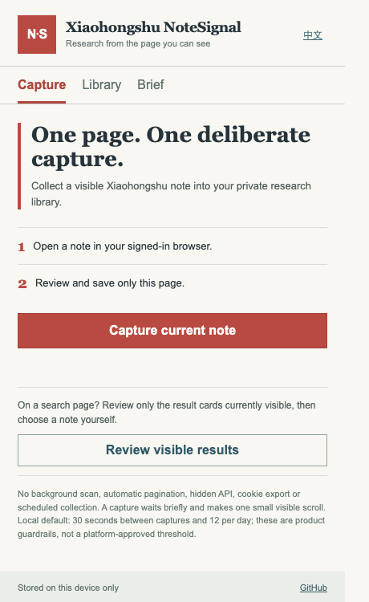

# Xiaohongshu NoteSignal · 小红书笔记风向标

**A deliberate Xiaohongshu research notebook, one visible page at a time.**

**逐页研究小红书内容，把观察变成自己的选题。**

NoteSignal is a small Chrome extension for creators who need to collect and compare examples. In the default manual mode, open a note yourself, press **Capture current page**, review the extracted title and visible text, add your own insight, then save it locally. The library exports CSV or JSON; the brief view turns saved observations into a source-linked writing prompt. An optional, separately installed visible-browser runner can collect a small, bounded sample without requiring a click on each note.

小红书创作者可在已登录的浏览器中打开笔记，主动点击「采集当前页」、核对可见文本、写下自己的判断，再保存到本机。资料库可导出 CSV/JSON，选题简报保留来源链接。



The screenshot shows the actual extension UI in its empty state; it does not depict a completed Xiaohongshu capture.

## Why this shape

The product follows the user's actual task: **see → select → interpret → write**. A large download count or a “viral score” would hide the editorial judgment that matters. NoteSignal therefore does not assign an invented performance grade or promise a viral post.

## Features / 功能

- English and Chinese interface, switchable in the popup / 中英文界面切换。
- User-initiated capture of one open note, with editable visible metrics / 用户主动采集单篇笔记及页面可见指标。
- A visible search-result shortlist: choose which note to open yourself / 只列当前屏幕可见的搜索结果，由用户选择下一篇。
- A short on-page dwell and one small scroll before extraction / 读取前短暂停留并在当前页小幅滚动一次。
- Editable preview and private insight field / 可编辑预览与个人判断。
- Local library with source links, CSV/JSON export / 本地资料库与导出。
- Source-linked research brief / 带来源的选题简报。
- Manual extension mode has no background traversal or automatic pagination. Optional automation stays in a visible browser and has a hard 5-note run limit. Neither mode uses hidden platform APIs, exports cookies, or schedules collection / 插件不后台采集；可选自动模式在可见浏览器运行、单次上限 5 篇，不读取隐藏接口或导出 Cookie。
- Conservative local defaults: 30 seconds between captures, 12 captures per UTC day. These are product guardrails, **not an official safe threshold** / 默认间隔 30 秒、每 UTC 日 12 次；这不是平台认可的安全阈值。
- If a verification or account-warning page is detected, capture stops / 检测到验证或异常页时停止。

## Quick start / 快速上手

1. Download the source or the release ZIP and unzip it.
2. Open `chrome://extensions`, enable **Developer mode**, choose **Load unpacked**, and select the folder containing `manifest.json`.
3. Open a Xiaohongshu search page and use **Review visible results** to choose a note, or open a note yourself.
4. On that note, click the NoteSignal icon, then **Capture current note**. Keep the tab visible while it pauses and scrolls once.
5. Review and correct the visible excerpt and metrics, add your original observation, and save. Switch the popup to 中文 if preferred.

解压后在 `chrome://extensions` 开启开发者模式，选择「加载已解压的扩展程序」，选中含 `manifest.json` 的目录。打开一篇笔记，点击插件，核对并保存。

No paid API is needed for this workflow. The extension uses Chrome's `activeTab` permission only after your click. It stores notes in `chrome.storage.local`; exporting a backup is your responsibility. It does not bypass login or verification.

此流程不需要购买 API。插件在点击后才使用 `activeTab` 权限，资料保存在本机 Chrome。它不会绕过登录或验证。

## Optional visible-browser automation / 可选自动采集

This is a separate terminal tool. It opens a **dedicated browser profile**; sign in yourself once. It searches the keyword, selects only visible note links, moves the mouse along a short curved path to the chosen card, clicks it, waits, reads the visible note, and saves each record incrementally. It never likes, follows, comments, publishes, or clicks unrelated UI. A visible verification, login request, account warning, unexpected page, or failed card navigation stops the run.

```bash
python3 -m pip install -r requirements-automation.txt
python3 automation/runner.py --login
python3 automation/runner.py --keyword "gardening" --limit 3 --max-scrolls 2
```

Output defaults to `~/.notesignal/research.json`; `--profile` and `--output` may change the locations. Import that file from **Library → Import runner JSON** in the extension; duplicate source links are skipped. The runner uses an installed Google Chrome, requires an interactive desktop, and never starts in the background. Its local maximum is 5 notes and 3 search scrolls per run, 12 saved notes per UTC day in the output ledger, with at least 30 seconds between saved notes. This is a product limit, not a guarantee against account restriction. The JSON contains page content and source links; inspect it before sharing. The default extension mode remains available without Playwright.

可选脚本使用独立浏览器资料夹，首次由你手动登录。它只点击搜索页中真实可见的笔记卡片，沿短曲线移动鼠标，逐篇停留、读取并立即写入本地 JSON；遇登录、验证或异常就停止。不会自动点赞、关注、评论或发布。单次最多 5 篇、最多滚动搜索页 3 次，笔记间至少 30 秒；这些数值不是防风控保证。

## Scope and limitations / 边界

Page layouts change. Extraction reads visible DOM text and may pick an incomplete title, author, metric label or excerpt; the manual preview is intentionally editable. The optional runner records raw visible fields for later review. Search discovery reads only links already visible on the current page. Note capture accepts individual note routes, not search or profile pages. It does not collect account data in bulk, calculate engagement from unverified numbers, or publish content. The mouse path, dwell, and scroll are interaction choices, not proof of lower enforcement risk. No browser behavior can guarantee that an account will never be rate-limited or restricted. Follow the platform's current rules and stop if the platform presents a verification or abnormal-account page.

页面结构会变，提取结果需人工核对。工具不会自动打开下一页、批量采集、自动发布，也不能保证账号绝无风控。

## Provenance

This repository is an original implementation for the LydiaTools personal account. An authorized coworker-provided private RPA archive was reviewed for workflow ideas such as source-linked records and explicit stopping points. No code, private configuration, output data, or internal platform interface from that archive is included here. The BFTOOLS team product remains separate.

这是 LydiaTools 个人项目的独立实现。已审阅同事授权提供的私有 RPA 压缩包，参考来源链接与异常停止等流程经验，没有复制其源码、私有配置或采集数据。毕方团队产品与本项目分开。

## Development

```bash
node --test tests/*.test.js
python3 -m unittest discover -s tests -p 'test_automation.py' -v
```

The extension has no build step or runtime dependencies. See [design notes](docs/DESIGN.md) and [中文说明](README.zh-CN.md).

## License

MIT. See [LICENSE](LICENSE).
