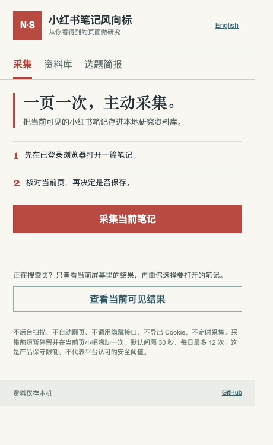

# 小红书笔记风向标 · NoteSignal

一款本地运行的小红书选题研究插件。它把「看见一篇笔记 → 主动采集 → 核对内容 → 写下自己的判断 → 汇总选题」做成短流程。



截图是插件真实界面的空资料库状态，不代表已完成小红书实测采集。

## 安装

**[下载 v0.1.1 插件 ZIP](https://github.com/LydiaTools/notesignal/releases/download/v0.1.1/notesignal-v0.1.1.zip)** · [查看版本说明](https://github.com/LydiaTools/notesignal/releases/tag/v0.1.1)

当前是早期预览版。本地模拟页面流程已测试。公开 ZIP 已通过[真实 Chromium 浏览器冒烟测试](https://github.com/LydiaTools/notesignal/actions/runs/37785360648)：校验包哈希、加载插件、打开弹窗、弹窗重载后保留中文设置，并在非笔记页停止采集。登录账号后的真实小红书采集尚未验收。

1. 下载并解压插件 ZIP，打开其中的 `notesignal-v0.1.1` 文件夹。
2. 打开 Chrome 的 `chrome://extensions`，开启「开发者模式」。
3. 点击「加载已解压的扩展程序」，选择含有 `manifest.json` 的文件夹。
4. 登录自己的小红书账号。可先在搜索页点「查看当前可见结果」，自行选一篇打开；也可直接打开一篇笔记。
5. 点击插件图标与「采集当前笔记」，保持页面可见，等待短暂停留和一次小幅滚动。
6. 修改预览与可见指标、写下自己的观察后保存；资料库可导出 CSV 或 JSON。

中英文界面可在插件右上角切换。当前版本不需要付费 API，不自动登录或发布。插件模式由你逐篇点击；可选脚本支持小样本自动采集。

## 可选：可见浏览器自动采集

此模式是独立的命令行脚本，需要 Python 和 Playwright。它使用专用浏览器资料夹，不读取你日常 Chrome 的登录态。首次手动登录后，可输入关键词运行：

```bash
python3 -m pip install -r requirements-automation.txt
python3 automation/runner.py --login
python3 automation/runner.py --keyword "园艺" --limit 3 --max-scrolls 2
```

脚本使用已安装的 Google Chrome，只定位当前可见的笔记卡片，沿短曲线移动鼠标后点击目标，逐篇停留、读取，并立即写入 `~/.notesignal/research.json`。运行后可在插件「资料库 → 导入脚本 JSON」选取该文件，重复来源会跳过。单次最多 5 篇、单个输出记录每 UTC 日最多 12 篇、搜索页最多滚动 3 次，笔记间至少 30 秒；遇登录、验证码、账号异常或页面跳转不符合预期就停止。不自动点赞、关注、评论或发布。输出可能不完整，使用前需核对原页面。

## 长期使用设计

插件只在用户点击后读取当前页面的可见 DOM；没有常驻内容脚本或后台任务。插件采集前会短暂停留并小幅滚动一次，不自动翻页。默认同一 UTC 日最多采集 12 次，两次至少间隔 30 秒；遇验证或账号异常页会持续暂停，人工处理后须重新检查。可选脚本有单次上限，也不绕过验证。所有间隔都是产品限制，不是平台官方安全线，更不能保证绝不触发平台限制。

本项目是个人号 LydiaTools 的独立实现。已审阅同事授权提供的私有 RPA 压缩包，参考了来源链接与异常停止等流程经验，没有复制其源码、私有配置或采集数据；毕方团队产品另行维护。
